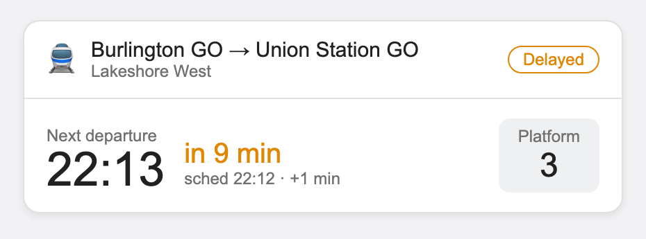
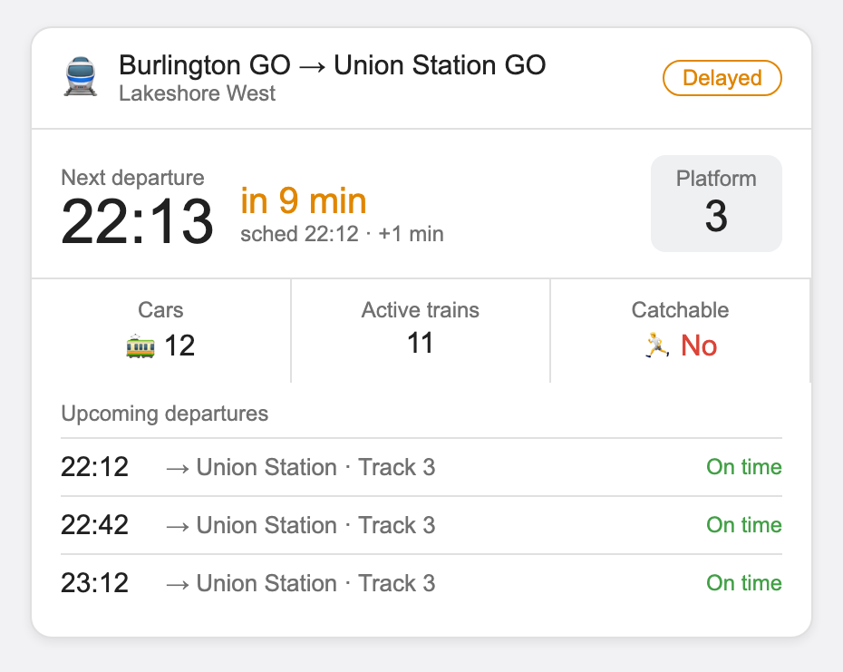
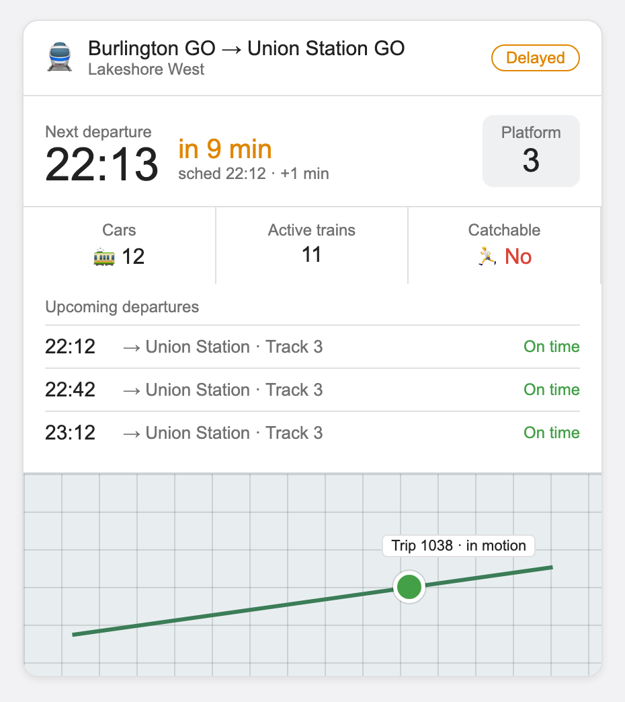

# GO Transit Card

A Lovelace card for the [GO Transit integration](https://github.com/bl0ckkkk/ha-gotransit) — a clean departure board for your route, with three layouts.

| Layout | Shows |
|--------|-------|
| `light` | Route header, next departure + live countdown, platform, status |
| `medium` *(default)* | Light, plus the Cars / Active trains / Catchable strip and the upcoming-departures list |
| `dense` | Medium, plus the live train position on a map |

---

## Screenshots

> Representative renderings. The `dense` map panel is rendered live by Home Assistant's own map card; here it's shown as a placeholder.

### light


### medium


### dense


---

## Install

### Via HACS (recommended)
1. HACS → ⋮ → **Custom repositories**
2. Add `https://github.com/bl0ckkkk/ha-gotransit-card`, category: **Dashboard**
3. Install **GO Transit Card**, then reload your browser.

### Manual
1. Copy `dist/go-transit-card.js` to `config/www/go-transit-card.js`
2. Settings → Dashboards → ⋮ → **Resources** → **+ Add resource**
   - URL: `/local/go-transit-card.js`
   - Type: **JavaScript module**

---

## Usage

The only required option is `entity` — point it at the integration's **Next Departure** sensor. Every other entity (platform, status, delay, upcoming, active trains, cars, catchable, map tracker) is auto-derived from that entity's ID.

### Minimal
```yaml
type: custom:go-transit-card
entity: sensor.go_burlington_go_union_station_go_lakeshore_west_next_departure
```

### Choose a layout
```yaml
type: custom:go-transit-card
entity: sensor.go_burlington_go_union_station_go_lakeshore_west_next_departure
layout: dense   # light | medium | dense
```

### Full options
```yaml
type: custom:go-transit-card
entity: sensor.go_burlington_go_union_station_go_lakeshore_west_next_departure
layout: medium
name: "Morning commute"          # optional title override
max_departures: 4                # rows in the upcoming list
map_aspect_ratio: "16:9"         # dense layout only
# Entity overrides (only needed if auto-derivation doesn't match your IDs):
platform_entity: sensor.rack_go_burlington_go_union_station_go_lakeshore_west_platform
status_entity: sensor.rack_go_burlington_go_union_station_go_lakeshore_west_status
delay_entity: sensor.go_burlington_go_union_station_go_lakeshore_west_delay
upcoming_entity: sensor.go_burlington_go_union_station_go_lakeshore_west_upcoming_departures
active_trains_entity: sensor.go_burlington_go_union_station_go_lakeshore_west_active_trains
consist_entity: sensor.go_burlington_go_union_station_go_lakeshore_west_train_consist
catchable_entity: binary_sensor.go_burlington_go_union_station_go_lakeshore_west_catchable
tracker_entity: device_tracker.go_burlington_go_union_station_go_lakeshore_west_train
```

> **Note on entity IDs:** the integration's Platform and Status sensors may carry an area prefix (e.g. `sensor.rack_…_platform`) while the others don't. If a field shows as `—`, set that field's `*_entity` override explicitly — the card hides any field whose entity it can't find rather than erroring.

---

## Options

| Option | Required | Default | Description |
|--------|----------|---------|-------------|
| `entity` | ✅ | — | The Next Departure sensor; the base for auto-deriving the rest |
| `layout` | ❌ | `medium` | `light`, `medium`, or `dense` |
| `name` | ❌ | from→to | Card title override |
| `max_departures` | ❌ | `4` | Rows shown in the upcoming list |
| `map_aspect_ratio` | ❌ | `16:9` | Map size (dense layout) |
| `*_entity` | ❌ | auto | Per-field entity overrides (see above) |

---

Not affiliated with or endorsed by Metrolinx / GO Transit.
